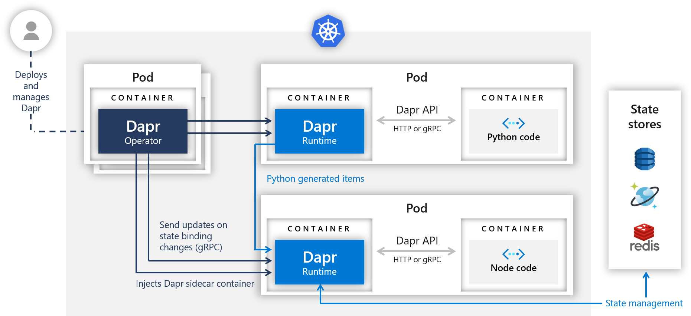

# 在 Windows 11 上安装 Dapr
## 安装


https://docs.dapr.io/getting-started/install-dapr-cli/


我使用不带Windows管理员权限的安装方式
``` shell
wget -q https://raw.githubusercontent.com/dapr/cli/master/install/install.sh -O - | DAPR_INSTALL_DIR="$HOME/dapr" /bin/bash
```

安装完成后 dapr -v 返回的是
``` shell
CLI version: 1.5.1
Runtime version: n/a
```

不过没关系，在 dapr init 时 会安装 Runtime
``` shell
dapr init
Making the jump to hyperspace...
Installing runtime version 1.5.1
Downloading binaries and setting up components...
Downloaded binaries and completed components set up.
daprd binary has been installed to C:\Users\xuefe\.dapr\bin.
dapr_placement container is running.
dapr_redis container is running.
dapr_zipkin container is running.
Use `docker ps` to check running containers.
Success! Dapr is up and running. To get started, go here: https://aka.ms/dapr-getting-started
```
验证一下
```shell
docker ps
CONTAINER ID   IMAGE               COMMAND                  CREATED         STATUS                   PORTS                              NAMES
aedd0a994300   daprio/dapr:1.5.1   "./placement"            2 minutes ago   Up 2 minutes             0.0.0.0:6050->50005/tcp            dapr_placement
17d256cbaed0   openzipkin/zipkin   "start-zipkin"           2 minutes ago   Up 2 minutes (healthy)   9410/tcp, 0.0.0.0:9411->9411/tcp   dapr_zipkin
fc56143de8f5   redis               "docker-entrypoint.s…"   2 minutes ago   Up 2 minutes             0.0.0.0:6379->6379/tcp             dapr_redis
```

Hello World 的实验手册中 nodejs 版本太旧了，现在已经不用 `nodejs -v` 了，而是用
```
node -v
v16.13.1

```
了。
整个文档以及源码都有大量更新，现在在
https://github.com/dapr/quickstarts/tree/master/hello-world

```shell
nohup dapr run --app-id nodeapp --app-port 3000 --dapr-http-port 3500 node app.js > dapr_nodeapp.log 2>&1 &
```
和
```shell
nohup dapr dashboard -p 9999 > dapr_dashboard.log 2>&1 &
```
都是占屏的命令，可以自己加 nohup

## Step 4 - Post messages to the service
在 /quickstarts/hello-world/node 下执行测试代码，因为 sample.json 等数据文件都在这里

```shell
curl -XPOST -d @sample.json -H Content-Type:application/json http://localhost:3500/v1.0/invoke/nodeapp/method/neworder

```

在 Windows 11 上安装 pip，以及 pip install requests 需要以管理员身份运行 CMD 再执行相关命令。
然后再执行
```shell
dapr run --app-id pythonapp python3 app.py

```
启动 App 时遇到
```shell
exec: "python3": executable file not found in %!P(MISSING)ATH%!(NOVERB)
```
报错，按照文档提示加参数
```
dapr run --app-id pythonapp cmd /c "python3 app.py"

```
也不行，最后
```
dapr run --app-id pythonapp cmd /c "python app.py"

```

这样才可以的。因为我本机安装好的 Python，没有 python3 这个命令，只有 python 命令。然后我之前的 Nodejs App 已经停止了，所以 Python App 自动重试
```
Checking if Dapr sidecar is listening on GRPC port 53869
Dapr sidecar is up and running.
Updating metadata for app command: cmd /c python app.py
You're up and running! Both Dapr and your app logs will appear here.

== APP == HTTP 500 => {"errorCode":"ERR_DIRECT_INVOKE","message":"fail to invoke, id: nodeapp, err: rpc error: code = Internal desc = error invoking app channel: dial tcp4 127.0.0.1:3000: connectex: No connection could be made because the target machine actively refused it."}
== APP == HTTP 500 => {"errorCode":"ERR_DIRECT_INVOKE","message":"fail to invoke, id: nodeapp, err: rpc error: code = Internal desc = error invoking app channel: dial tcp4 127.0.0.1:3000: connectex: No connection could be made because the target machine actively refused it."}
== APP == HTTP 500 => {"errorCode":"ERR_DIRECT_INVOKE","message":"fail to invoke, id: nodeapp, err: rpc error: code = Internal desc = error invoking app channel: dial tcp4 127.0.0.1:3000: connectex: No connection could be made because the target machine actively refused it."}
...
time="2022-01-07T11:51:45.0888094+08:00" level=info msg="Shutting down actor" app_id=pythonapp instance=cnxuefe-sp7 scope=dapr.runtime type=log ver=1.5.1

terminated signal received: shutting down
Exited Dapr successfully
Exited App successfully

```
直到我手工停止。

重启windows再试
```
dapr run --app-id pythonapp cmd /c "python app.py"

```
运行这个 Python App 会让之前的 Node App 不停地创建出新订单，即使停止了 dapr 进程，背后的 Python 进程还在持续，直到把 python 进程也停止才会停止运行。


# 在 AKS 上安装 Dapr
用的是 NodeInstaller 那个 AKS 集群。



https://github.com/dapr/quickstarts/tree/master/hello-kubernetes

先安装
https://docs.dapr.io/getting-started/install-dapr-cli/

其实是先在本地电脑上安装好 Dapr CLI ，然后使用 Azure CLI 连接到创建好的 AKS 集群，使得 kubectl 可以管理 AKS 集群。注意这时必须使用 Windows 原生的 CMD 命令行工具，Dapr 才能读取 C:\Users\username\.kube\config 中的 Kubernetes 配置。用第三方的终端如 MobaXterm 不行。
然后执行
```shell
dapr init -k
Making the jump to hyperspace...
Note: To install Dapr using Helm, see here: https://docs.dapr.io/getting-started/install-dapr-kubernetes/#install-with-helm-advanced

Deploying the Dapr control plane to your cluster...
Success! Dapr has been installed to namespace dapr-system. To verify, run `dapr status -k' in your terminal. To get started, go here: https://aka.ms/dapr-getting-started

```
然后验证一下
```shell
dapr status -k
  NAME                   NAMESPACE    HEALTHY  STATUS   REPLICAS  VERSION  AGE  CREATED
  dapr-operator          dapr-system  True     Running  1         1.5.1    2m   2022-01-07 15:39.52
  dapr-sentry            dapr-system  True     Running  1         1.5.1    2m   2022-01-07 15:39.52
  dapr-sidecar-injector  dapr-system  True     Running  1         1.5.1    2m   2022-01-07 15:39.52
  dapr-placement-server  dapr-system  True     Running  1         1.5.1    2m   2022-01-07 15:39.52
  dapr-dashboard         dapr-system  True     Running  1         0.9.0    2m   2022-01-07 15:39.52
```
```shell
> kubectl get pods -n dapr-system -o wide
NAME                                     READY   STATUS    RESTARTS   AGE     IP            NODE                                NOMINATED NODE   READINESS GATES
dapr-dashboard-87fcd7c55-zj5xx           1/1     Running   0          2m38s   10.244.0.33   aks-nodepool1-29740120-vmss000000   <none>           <none>
dapr-operator-6c994c69b7-fbnw6           1/1     Running   1          2m38s   10.244.0.30   aks-nodepool1-29740120-vmss000000   <none>           <none>
dapr-placement-server-0                  1/1     Running   0          2m38s   10.244.0.34   aks-nodepool1-29740120-vmss000000   <none>           <none>
dapr-sentry-64789d9cb5-kgmpk             1/1     Running   0          2m38s   10.244.0.31   aks-nodepool1-29740120-vmss000000   <none>           <none>
dapr-sidecar-injector-7698bcc85f-gftkl   1/1     Running   0          2m38s   10.244.0.32   aks-nodepool1-29740120-vmss000000   <none>           <none>

```
部署应用，来到 /quickstarts/hello-kubernetes/ 目录下
```shell
kubectl apply -f ./deploy/redis.yaml
component.dapr.io/statestore created

```

## 使用 Redis 创建状态存储

参照 https://docs.dapr.io/getting-started/configure-state-pubsub/ 创建一个 Redis 的 State Store

```shell
helm install redis bitnami/redis
NAME: redis
LAST DEPLOYED: Fri Jan  7 16:52:47 2022
NAMESPACE: default
STATUS: deployed
REVISION: 1
TEST SUITE: None
NOTES:
CHART NAME: redis
CHART VERSION: 15.7.1
APP VERSION: 6.2.6

** Please be patient while the chart is being deployed **

Redis&trade; can be accessed on the following DNS names from within your cluster:

    redis-master.default.svc.cluster.local for read/write operations (port 6379)
    redis-replicas.default.svc.cluster.local for read-only operations (port 6379)


To get your password run:

    export REDIS_PASSWORD=$(kubectl get secret --namespace default redis -o jsonpath="{.data.redis-password}" | base64 --decode)

To connect to your Redis&trade; server:

1. Run a Redis&trade; pod that you can use as a client:

   kubectl run --namespace default redis-client --restart='Never'  --env REDIS_PASSWORD=$REDIS_PASSWORD  --image docker.io/bitnami/redis:6.2.6-debian-10-r90 --command -- sleep infinity

   Use the following command to attach to the pod:

   kubectl exec --tty -i redis-client \
   --namespace default -- bash

2. Connect using the Redis&trade; CLI:
   REDISCLI_AUTH="$REDIS_PASSWORD" redis-cli -h redis-master
   REDISCLI_AUTH="$REDIS_PASSWORD" redis-cli -h redis-replicas

To connect to your database from outside the cluster execute the following commands:

    kubectl port-forward --namespace default svc/redis-master 6379:6379 &
    REDISCLI_AUTH="$REDIS_PASSWORD" redis-cli -h 127.0.0.1 -p 6379
```
记下这里的 redis-master.default.svc.cluster.local 作为 Redis 主节点的 DNS 名。后面用到。
用这个 DNS 名称，填写到创建的 %USERPROFILE%/.dapr/components/redis-state.yaml 配置文件中。例如：
```yaml
apiVersion: dapr.io/v1alpha1
kind: Component
metadata:
  name: statestore
  namespace: default
spec:
  type: state.redis
  version: v1
  metadata:
  - name: redisHost
    value: redis-master.default.svc.cluster.local:6379
  - name: redisPassword
    secretKeyRef:
      name: redis
      key: naCRGuROQ0
  # uncomment below for connecting to redis cache instances over TLS (ex - Azure Redis Cache)
  # - name: enableTLS
  #   value: true
```
然后不需要重启 Dapr 服务，查看 components 已经有了这个新的组件。

```shell
dapr components -k
NAME        TYPE         VERSION  SCOPES  CREATED              AGE
statestore  state.redis  v1               2022-01-07 15:56.18  1h

```


```shell
kubectl apply -f ./deploy/node.yaml

```
等待期间可以
```shell

kubectl rollout status deploy/nodeapp
Waiting for deployment "nodeapp" rollout to finish: 0 of 1 updated replicas are available...
deployment "nodeapp" successfully rolled out

```

```shell
kubectl get pods -o wide
NAME                       READY   STATUS    RESTARTS   AGE    IP            NODE                                NOMINATED NODE   READINESS GATES
nodeapp-84867c5867-skbpt   2/2     Running   0          4m3s   10.244.0.35   aks-nodepool1-29740120-vmss000000   <none>           <none>
```

```shell
kubectl get svc nodeapp
NAME      TYPE           CLUSTER-IP   EXTERNAL-IP    PORT(S)        AGE
nodeapp   LoadBalancer   10.0.5.209   52.131.81.49   80:32554/TCP   80s
```

```shell
kubectl port-forward service/nodeapp 8080:80
```


打开浏览器访问 http://localhost:8080/ports 可以看到
```JSON
{"DAPR_HTTP_PORT":"3500","DAPR_GRPC_PORT":"50001"}

```

调用 node app
```shell
curl --request POST --data "@sample.json" --header Content-Type:application/json http://localhost:8080/neworder

```

部署 Python 应用
```shell
kubectl apply -f ./deploy/python.yaml
deployment.apps/pythonapp created

kubectl rollout status deploy/pythonapp
deployment "pythonapp" successfully rolled out

```

```shell
kubectl logs --selector=app=node -c node --tail=-1

```
可查看 NodeJS app 的日志，类似
```text
Node App listening on port 3000!
DAPR_HTTP_PORT: 3500
DAPR_GRPC_PORT: 50001
DAPR_HTTP_PORT: 3500
DAPR_GRPC_PORT: 50001
Got a new order! Order ID: 42
Got a new order! Order ID: 42
Failed to persist state.
Got a new order! Order ID: 42
Successfully persisted state.
Got a new order! Order ID: 2
Successfully persisted state.
Got a new order! Order ID: 3
Successfully persisted state.
Got a new order! Order ID: 4
Successfully persisted state.
Got a new order! Order ID: 5
Successfully persisted state.
Got a new order! Order ID: 6
Successfully persisted state.
Got a new order! Order ID: 7
Successfully persisted state.
Got a new order! Order ID: 8
Successfully persisted state.
Got a new order! Order ID: 9
Successfully persisted state.

```
再反复访问 http://localhost:8080/order 可看到
{"orderId":81} 、{"orderId":82} 、{"orderId":83} 等不断刷新的新订单 ID。

最后要停止写入订单数据，需要把 Python pod 删掉。
```shell
kubectl delete -f ./deploy/python.yaml

```